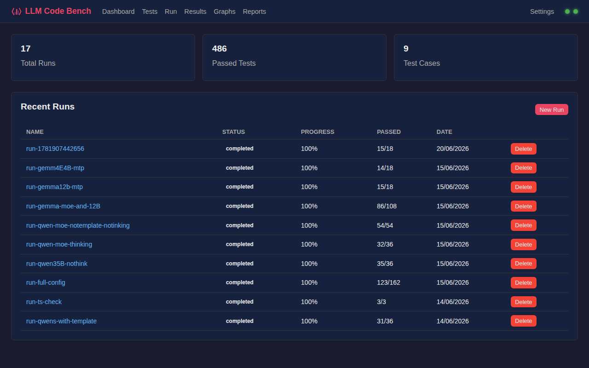
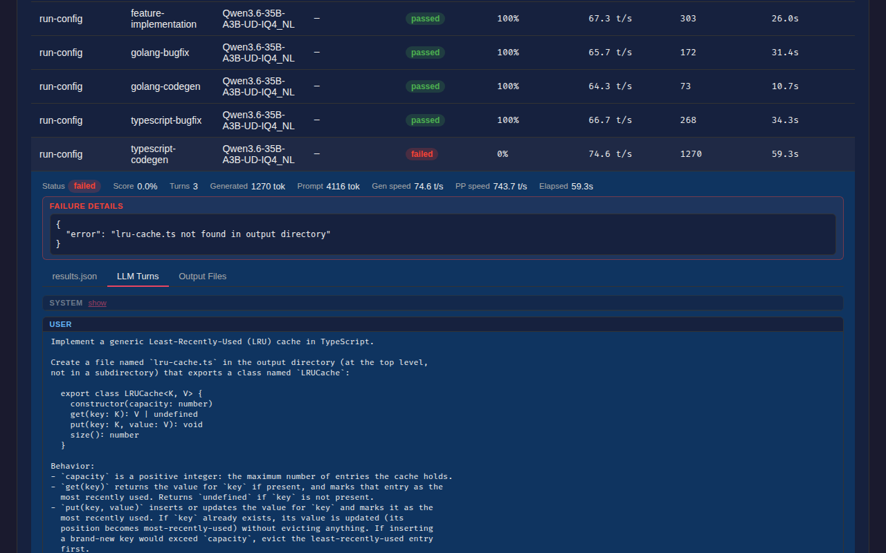
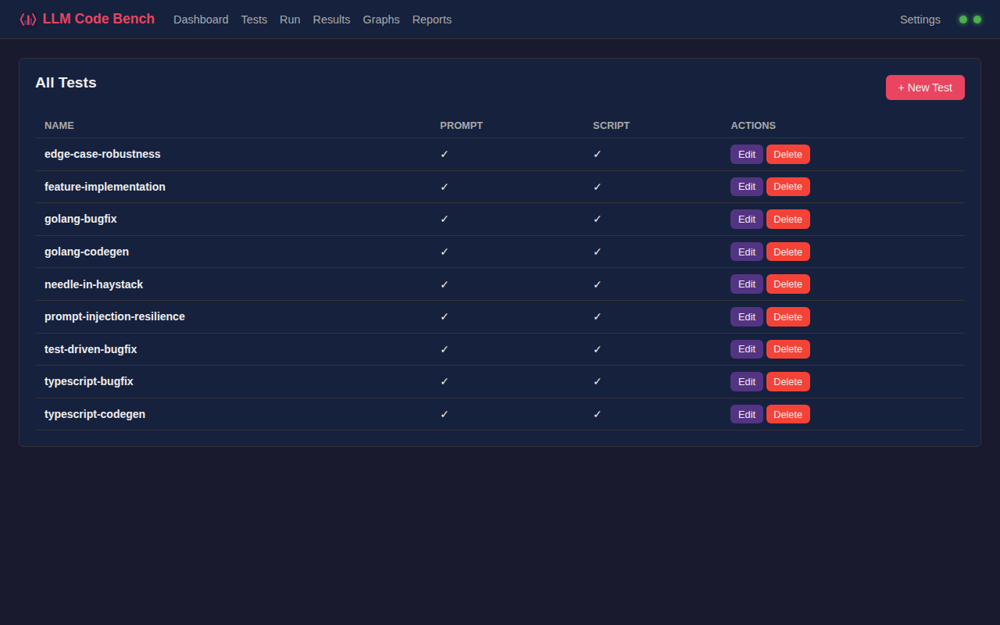
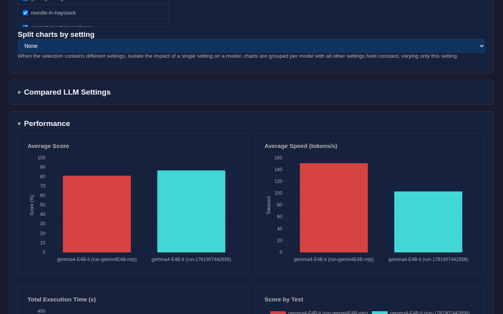

<div align="center">
  
  <h1>LLM Code Bench</h1>
</div>

A web-based tool for benchmarking LLMs on coding tasks by running test prompts against models served by a [llama.cpp](https://github.com/ggml-org/llama.cpp) HTTP server.

> **Personal tool, not production software.**
> This project is built for a single use case: a llama.cpp server reachable on a local network (home lab, LAN). Authentication, multi-user support, and cloud inference providers are out of scope — there is no plan to cover those cases. The code is open source in case it is useful to others in a similar setup.

## License

[MIT](./LICENSE)

## Features

- Define test cases with a prompt and a validation script (TypeScript)
- Optional `context/` directory — starting codebase copied into the agent's workspace before each run
- Select models and configure generation parameters (temperature, max tokens, top-p, repeat penalty, seed…)
- Repeat mode: run each test N times per model for statistical robustness
- Models are loaded/unloaded automatically via llama.cpp's router mode
- Model agents get file tools + `run_command` scoped to a sandboxed output directory
- Live run monitoring via SSE: real-time progress, per-test skip/stop controls
- Results browser: filter by run / test / model / status, expand any row to inspect
  - Stats summary (tokens, speed, elapsed, score, checks)
  - LLM conversation replay (turns viewer)
  - Raw `results.json`
  - Generated files with syntax highlighting (Monaco)
- Scatter and bar charts for cross-model / cross-run comparison, split by model settings
- AI-generated analysis reports across runs
- Settings UI to configure llama server URL and API key (persisted, override env vars)
- SQLite for run metadata and settings; test definitions and results on the filesystem

## Screenshots

| Dashboard | Results browser |
|:---------:|:---------------:|
|  |  |

| Test list | Comparison graphs |
|:---------:|:-----------------:|
|  |  |

## Quick Start

```bash
# 1. Install and build
npm ci
npm run build

# 2. Run locally
LLAMA_SERVER_URL=http://your-llama-server:8080 \
TESTS_DIR=./tests OUTPUT_DIR=./output DATA_DIR=./data \
npm start
```

Or with Docker:

```bash
LLAMA_SERVER_URL=http://host.docker.internal:8080 docker compose up -d
```

Open `http://localhost:3000` in your browser.

## Documentation

- [doc/writing-test-cases.md](./doc/writing-test-cases.md) — how to write prompts, validation scripts, and use the `context/` codebase convention
- [doc/test-ideas.md](./doc/test-ideas.md) — backlog of test case ideas

For the internal architecture (runner, storage, SSE flow, tool sandbox), see [AGENTS.md](./AGENTS.md) and [CLAUDE.md](./CLAUDE.md).

## Architecture

```
┌──────────────────┐     ┌──────────────────────┐     ┌──────────────────┐
│  Web UI (TS)     │────▶│  Express API          │────▶│  llama.cpp       │
│  Monaco editor   │     │  Runner + SSE         │     │  HTTP Server     │
│  Chart.js        │     │  Tool Executor        │     │  (router mode)   │
└──────────────────┘     └─────────┬────────────┘     └──────────────────┘
                                   │
                    ┌──────────────┼───────────────┐
                    │              │               │
                 SQLite         tests/          output/
               (runs, settings)  (prompts,      (turns.json,
                                  scripts,       results.json,
                                  context/)      files/)
```

## Directory Layout

```
tests/                          # Test definitions (mounted volume)
  <test-name>/
    prompt.txt                  # Prompt sent to the model
    test.ts                     # Validation script (outputs JSON on stdout)
    context/                    # Optional — copied into the agent's workspace
output/                         # Run results (mounted volume)
  <test-name>/
    <run-id>_<model>/
      turns.json                # Full LLM conversation log
      results.json              # Stats + test outcome
      files/                    # Model-generated files
data/
  llm-code-bench.db             # SQLite: run metadata + settings
  settings.json                 # llama server URL/key (UI-persisted)
```

## Model Tools

During a test run the model agent has these tools, scoped to its `files/` directory (path traversal is blocked server-side):

| Tool | Description |
|------|-------------|
| `read_file(path)` | Read a file |
| `read_lines(path, start, end)` | Partial read |
| `write_file(path, content)` | Write a file |
| `grep(pattern, path)` | Regex search |
| `list_files(path)` | List directory contents |
| `run_command(command)` | Run a shell command (e.g. `go build ./...`, `tsc --noEmit`) — sandboxed with bwrap when available |

## API

| Method | Path | Description |
|--------|------|-------------|
| `GET` | `/api/tests` | List test definitions |
| `GET` | `/api/tests/:name` | Get a test |
| `PUT` | `/api/tests/:name` | Create/update a test |
| `DELETE` | `/api/tests/:name` | Delete a test |
| `GET` | `/api/models` | List models from llama server |
| `GET` | `/api/models/health` | Check llama server health |
| `POST` | `/api/runs` | Create and launch a run |
| `GET` | `/api/runs` | List runs |
| `GET` | `/api/runs/:id` | Get run details |
| `POST` | `/api/runs/:id/cancel` | Cancel a run |
| `POST` | `/api/runs/:id/skip-test` | Skip a pending/running test |
| `GET` | `/api/runs/:id/events` | SSE stream for live progress |
| `DELETE` | `/api/runs/:id` | Delete a run and its output |
| `GET` | `/api/results` | Query results (`runId`, `testName`, `modelId`, `status`) |
| `GET` | `/api/results/stats` | Aggregate stats |
| `GET` | `/api/results/:runId/:testName/:modelId` | Single result |
| `GET` | `/api/results/:runId/:testName/:modelId/files` | List generated files |
| `GET` | `/api/results/:runId/:testName/:modelId/file?path=` | Get file content |
| `GET` | `/api/results/:runId/:testName/:modelId/turns` | LLM conversation turns |
| `GET` | `/api/results/:runId/:testName/:modelId/raw` | Raw `results.json` |
| `GET` | `/api/reports` | List saved analysis reports |
| `POST` | `/api/reports` | Save a report |
| `GET` | `/api/reports/:id` | Get a report |
| `DELETE` | `/api/reports/:id` | Delete a report |
| `POST` | `/api/reports/generate` | Generate a report with an LLM |
| `GET` | `/api/settings` | Get current settings |
| `PUT` | `/api/settings` | Save settings |
| `POST` | `/api/settings/test` | Test llama server reachability |

## Configuration

| Environment Variable | Default | Description |
|---------------------|---------|-------------|
| `LLAMA_SERVER_URL` | `http://host.docker.internal:8080` | llama.cpp server URL (overridable via Settings UI) |
| `LLAMA_API_KEY` | _(none)_ | Bearer token for the llama server (overridable via Settings UI) |
| `PORT` | `3000` | Web app port |
| `TESTS_DIR` | `/app/tests` | Test definitions directory |
| `OUTPUT_DIR` | `/app/output` | Results output directory |
| `DATA_DIR` | `/app/data` | SQLite DB + settings file |

## Requirements

- Node.js LTS
- A running [llama.cpp](https://github.com/ggml-org/llama.cpp) HTTP server in router mode (`--models-dir`)
- Docker (optional)
- `bwrap` (optional) — enables filesystem sandboxing for `run_command`
